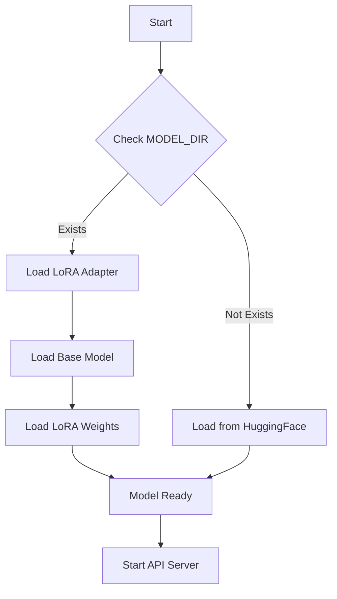
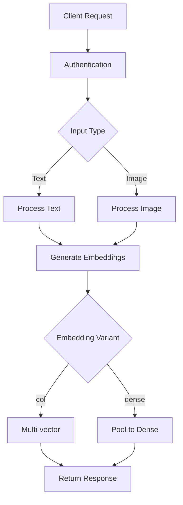

# ColPali Multimodal Embedding API

A production-ready FastAPI service for generating embeddings from text and images using the ColPali ColQwen2.5 model with LoRA adapter support.

## Features

- 🚀 **High Performance**: Optimized for production with async FastAPI
- 🔒 **Offline Operation**: Fully offline model loading with LoRA adapter support
- 📝 **Text Embeddings**: Support for both multi-vector (col) and dense variants
- 🖼️ **Image Embeddings**: Process images with automatic resizing and validation
- 🛡️ **Security**: Optional authentication and comprehensive input validation
- 📊 **Monitoring**: Health checks and detailed usage metrics
- 🧪 **Testing**: Comprehensive unit tests with 90%+ coverage
- 🔧 **DevOps**: CI/CD pipeline with automated testing and deployment

## Docker Hub

🐳 **Official Docker Image**: [`kirk07/colnomic-embed`](https://hub.docker.com/r/kirk07/colnomic-embed)

> ✅ **Successfully Published**: The Docker image is now available on Docker Hub and ready for deployment!

### Available Tags

| Tag | Description | Size | Use Case |
|-----|-------------|------|----------|
| `latest` | Latest stable release | ~8GB | Production |
| `3b` | ColNomic 3B model variant | ~8GB | Specific model version |

### Image Details

- **Base Image**: `pytorch/pytorch:2.5.1-cuda12.1-cudnn9-runtime`
- **Model**: ColPali ColQwen2.5 with LoRA adapter
- **Architecture**: `linux/amd64`
- **Port**: `8000`
- **Health Check**: `GET /healthz`
- **Memory**: ~8GB RAM recommended
- **Storage**: ~8GB disk space
- **Runtime Model Download**: Models downloaded at container startup

### Quick Pull & Run

```bash
# Pull the latest image
docker pull kirk07/colnomic-embed:latest

# Run with basic configuration
docker run -d \
  --name colnomic-api \
  -p 8000:8000 \
  kirk07/colnomic-embed:latest

# Test the API
curl http://localhost:8000/healthz
```

### Docker Hub Features

- ✅ **Production Ready**: Optimized for production deployment
- ✅ **AMD64 Architecture**: Supports Linux AMD64 platforms
- ✅ **Runtime Model Download**: Models downloaded at container startup
- ✅ **Version Tags**: Multiple tags for different use cases
- ✅ **Documentation**: Comprehensive usage examples
- ✅ **Health Monitoring**: Built-in health check endpoints

## Quick Start

### Using Docker (Recommended)

#### Option 1: Use Pre-built Image from Docker Hub

```bash
# Pull the official image
docker pull kirk07/colnomic-embed:latest

# Run the container
docker run -p 8000:8000 kirk07/colnomic-embed:latest

# Test the API
curl http://localhost:8000/healthz
```

#### Option 2: Build from Source

```bash
# Build the image
docker build -t nomic-vlm-inference ./api/

# Run the container
docker run -p 8000:8000 nomic-vlm-inference

# Test the API
curl http://localhost:8000/healthz
```

### Using Python

```bash
# Install dependencies
pip install -r api/requirements.txt

# Run the server
cd api && uvicorn app:app --host 0.0.0.0 --port 8000
```

## API Usage

### Health Check

```bash
curl http://localhost:8000/healthz
```

Response:
```json
{
  "ok": true,
  "model": "/models/3b",
  "device": "cpu",
  "offline": true
}
```

### Text Embeddings

#### Multi-vector (col) embeddings:
```bash
curl -X POST http://localhost:8000/v1/embed \
  -H "Content-Type: application/json" \
  -d '{
    "input": {
      "texts": ["Hello world", "This is a test"]
    },
    "options": {
      "variant": "col",
      "normalize": true
    }
  }'
```

#### Dense embeddings:
```bash
curl -X POST http://localhost:8000/v1/embed \
  -H "Content-Type: application/json" \
  -d '{
    "input": {
      "texts": ["Hello world"]
    },
    "options": {
      "variant": "dense",
      "normalize": true
    }
  }'
```

### Image Embeddings

```bash
curl -X POST http://localhost:8000/v1/embed \
  -H "Content-Type: application/json" \
  -d '{
    "input": {
      "image_b64": ["base64_encoded_image_data"]
    },
    "options": {
      "variant": "col",
      "normalize": true
    }
  }'
```

## API Reference

### Endpoints

#### `GET /healthz`
Health check endpoint.

**Response:**
```json
{
  "ok": true,
  "model": "string",
  "device": "string",
  "offline": boolean
}
```

#### `POST /v1/embed`
Generate embeddings for text or images.

**Request Body:**
```json
{
  "input": {
    "texts": ["string"] | "image_b64": ["string"]
  },
  "options": {
    "variant": "col" | "dense",
    "normalize": boolean
  }
}
```

**Response:**
```json
{
  "model": "string",
  "variant": "string",
  "data": [number[][]],
  "usage": {
    "latency_ms": number,
    "batch_size": number,
    "variant": "string",
    "request_id": "string"
  }
}
```

### Authentication

Set the `INTERNAL_KEY` environment variable to enable authentication:

```bash
export INTERNAL_KEY="your-secret-key"
```

Then include the key in requests:
```bash
curl -H "x-internal-key: your-secret-key" ...
```

## Configuration

### Environment Variables

| Variable | Default | Description |
|----------|---------|-------------|
| `MODEL_ID` | `nomic-ai/colnomic-embed-multimodal-3b` | Hugging Face model ID |
| `MODEL_REV` | `None` | Model revision/commit |
| `MODEL_DIR` | `None` | Local model directory path |
| `INTERNAL_KEY` | `None` | Authentication key |
| `MAX_BATCH_ITEMS` | `64` | Maximum batch size |
| `MAX_TEXT_LEN` | `2048` | Maximum text length |

### Model Loading

The API supports two modes:

1. **Online Mode**: Downloads model from Hugging Face (requires internet)
2. **Offline Mode**: Uses pre-downloaded model files (no internet required)

For offline mode, ensure the model is downloaded to `/models/3b` and `/models/base` (for LoRA adapter).

## Development

### Setup

```bash
# Clone the repository
git clone <repository-url>
cd nomic-vlm-inference

# Install development dependencies
pip install -r requirements-dev.txt

# Install pre-commit hooks
pre-commit install
```

### Running Tests

```bash
# Run all tests
pytest

# Run with coverage
pytest --cov=api --cov-report=html

# Run specific test file
pytest tests/test_api.py -v
```

### Code Quality

```bash
# Format code
black api/ tests/

# Sort imports
isort api/ tests/

# Lint code
flake8 api/ tests/

# Type checking
mypy api/

# Security scan
bandit -r api/
```

### Pre-commit Hooks

The repository includes pre-commit hooks that run automatically on commit:

- Code formatting (black, isort)
- Linting (flake8)
- Type checking (mypy)
- Security scanning (bandit)

## Architecture

### Model Loading



### Request Flow



## Deployment

### Docker Compose (Recommended for Production)

Create a `docker-compose.yml`:

```yaml
version: '3.8'

services:
  colnomic-api:
    image: kirk07/colnomic-embed:latest
    ports:
      - "8000:8000"
    environment:
      - INTERNAL_KEY=your-secret-key-here
      - MAX_BATCH_ITEMS=64
      - MAX_TEXT_LEN=2048
    restart: unless-stopped
    healthcheck:
      test: ["CMD", "curl", "-f", "http://localhost:8000/healthz"]
      interval: 30s
      timeout: 10s
      retries: 3
      start_period: 60s
    deploy:
      resources:
        limits:
          memory: 16G
        reservations:
          memory: 8G
```

Run with:
```bash
docker-compose up -d
```

### Docker Run (Simple Deployment)

```bash
# Basic deployment
docker run -d \
  --name colnomic-api \
  -p 8000:8000 \
  -e INTERNAL_KEY=your-secret-key \
  kirk07/colnomic-embed:latest

# With resource limits
docker run -d \
  --name colnomic-api \
  -p 8000:8000 \
  -e INTERNAL_KEY=your-secret-key \
  --memory=16g \
  --cpus=4 \
  kirk07/colnomic-embed:latest
```

### Runpod Deployment

1. **Use published Docker image**: `kirk07/colnomic-embed:latest`

2. **Update Runpod template** with image: `kirk07/colnomic-embed:latest`

3. **Deploy using Runpod API**:
   ```bash
   curl -X POST "https://api.runpod.io/v2/your-template-id/runsync" \
     -H "Authorization: Bearer $RUNPOD_API_KEY" \
     -H "Content-Type: application/json" \
     -d '{
       "input": {
         "docker_image": "kirk07/colnomic-embed:latest",
         "env": {
           "INTERNAL_KEY": "your-secret-key"
         }
       }
     }'
   ```

4. **Monitor health endpoints**: `GET /healthz`

### Scaling

- **Horizontal**: Multiple container instances behind load balancer
- **Vertical**: Increase container resources (CPU/GPU)
- **Batch Processing**: Increase `MAX_BATCH_ITEMS` for larger batches
- **GPU Acceleration**: Use CUDA-enabled base image for faster inference

## Monitoring

### Health Checks

- **Endpoint**: `GET /healthz`
- **Metrics**: Response time, batch size, variant usage
- **Alerts**: Set up monitoring for health check failures

### Logging

The service logs:
- Model loading status
- Request processing times
- Error conditions
- Authentication attempts

## Troubleshooting

### Common Issues

1. **Model Loading Errors**
   - Ensure model files exist in `/models/3b` and `/models/base`
   - Check file permissions
   - Verify model compatibility

2. **Image Processing Errors**
   - Ensure images are valid base64 encoded PNG/JPEG
   - Check image dimensions (minimum 32x32 pixels)
   - Verify RGB format

3. **Authentication Errors**
   - Check `INTERNAL_KEY` environment variable
   - Verify header name: `x-internal-key`

### Debug Mode

Enable debug logging:
```bash
export LOG_LEVEL=DEBUG
```

## Contributing

1. Fork the repository
2. Create a feature branch
3. Make changes with tests
4. Run pre-commit hooks
5. Submit a pull request

## License

MIT License - see LICENSE file for details.

## Support

For issues and questions:
- Create an issue on GitHub
- Check the troubleshooting section
- Review the API documentation

---

**Built with ❤️ by the AI Engineering Team**